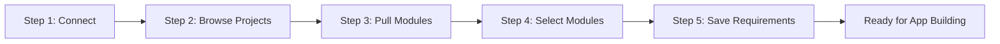

# DOORS Next Integration - Interactive Demo Workflow Plan

## Executive Summary

This plan outlines the design for a clean, interactive demo workflow using **Streamlit** to guide users through connecting to DOORS Next Generation (DNG), browsing 107 projects, selecting modules, and exporting requirements to a "DNG Requirements" folder for app building.

**Key Decision:** Use Streamlit for the demo interface - it provides the best balance of visual appeal, ease of development, and user experience for a guided workflow.

---

## 1. Project Cleanup Strategy

### Files to Keep (Core Functionality)
- [`doors_client.py`](doors_client.py) - Main DOORS API client ✅
- [`doors_mcp_server.py`](doors_mcp_server.py) - MCP server for Bob integration ✅
- [`README.md`](README.md) - Documentation ✅
- [`requirements.txt`](requirements.txt) - Dependencies ✅
- [`.env.example`](.env.example) - Credential template ✅
- [`.gitignore`](.gitignore) - Git configuration ✅
- `mcp_config.json` - MCP configuration ✅

### Files to Archive (48 files total)

Create `archive/` directory structure:
```
archive/
├── test_scripts/        # 17 test_*.py files
├── debug_scripts/       # 18 debug/find/get/explore scripts
├── data_files/          # 8 JSON/XML output files
└── docs/               # 3 historical docs
```

**Commands to execute:**
```bash
mkdir -p archive/{test_scripts,debug_scripts,data_files,docs}

# Move test scripts
mv test_*.py archive/test_scripts/

# Move debug/exploration scripts
mv debug_*.py diagnose_*.py explore_*.py investigate_*.py archive/debug_scripts/
mv find_*.py get_*.py pull_requirements.py archive/debug_scripts/

# Move data files (keep mcp_config.json)
mv *.json *.xml archive/data_files/
mv archive/data_files/mcp_config.json .

# Move docs
mv FINDING_MODULES_GUIDE.md "Jazz Foundation Services.html" "rootservices (1).xmp" archive/docs/

# Delete artifact
rm "=0.9.0"

# Update .gitignore
echo -e "\narchive/\noutput/\n.streamlit/secrets.toml" >> .gitignore
```

---

## 2. Demo Interface: Streamlit App

### Why Streamlit?

| Feature | Streamlit | CLI | MCP Server |
|---------|-----------|-----|------------|
| Visual Interface | ✅ Excellent | ❌ Text only | ⚠️ Client-dependent |
| State Management | ✅ Built-in | ⚠️ Manual | ⚠️ Manual |
| User Experience | ✅ Intuitive | ⚠️ Technical | ✅ Conversational |
| Demo-Friendly | ✅ Perfect | ❌ Limited | ⚠️ Requires Bob |
| Development Speed | ✅ Fast | ✅ Fast | ⚠️ Moderate |

**Decision:** Streamlit provides the best demo experience with minimal development effort.

### App Architecture

```
doors-next-bob-integration/
├── app.py                          # Main Streamlit app (NEW)
├── doors_client.py                 # Existing API client
├── requirements.txt                # Add streamlit
├── .streamlit/
│   └── config.toml                # Streamlit config (NEW)
├── output/
│   └── DNG_Requirements/          # Export folder (NEW)
│       ├── metadata.json
│       ├── requirements.json
│       ├── requirements.csv
│       └── README.md
└── archive/                       # Archived files (NEW)
```

---

## 3. Conversational Workflow Design

### 5-Step User Journey



### Step 1: Connect to DNG 🔐

**Goal:** Authenticate with DOORS Next

**UI Elements:**
- Welcome message
- Input fields: URL, Username, Password
- "Load from .env" button
- "Connect" button
- Connection status indicator

**Session State:**
```python
{
    'authenticated': False,
    'client': None,
    'credentials': {'url': '', 'username': '', 'password': ''}
}
```

**Error Handling:**
- 401 Unauthorized → "Invalid credentials, try again"
- Network timeout → "Check network connection"
- Invalid URL → Show format example

---

### Step 2: Browse Projects 📋

**Goal:** Select from 107 available projects

**UI Elements:**
- Project count badge: "107 projects available"
- Two options:
  - "List All Projects" → Paginated table (20 per page)
  - "Search Projects" → Filter as you type
- Project table: Number | Name | ID | Select button
- Pagination controls

**Session State:**
```python
{
    'projects': [],              # Cached list of all projects
    'selected_project': None,    # Selected project object
    'show_all': False,
    'search_query': ''
}
```

**Error Handling:**
- No projects found → "Check permissions"
- API error → Retry with backoff
- Empty search → "No matches found"

---

### Step 3: Pull Modules 📦

**Goal:** Retrieve modules from selected project

**UI Elements:**
- Selected project info card
- "Pull Modules" button
- Loading indicator
- Module tree display (hierarchical with indentation)
- Module count badge

**Session State:**
```python
{
    'modules': [],               # List of modules with hierarchy
    'module_count': 0
}
```

**Error Handling:**
- No modules → "This project has no modules"
- Timeout → "Continue waiting?" with progress
- Permission denied → "Check access rights"

---

### Step 4: Select Modules ✅

**Goal:** Choose which modules to export

**UI Elements:**
- "Select All" / "Deselect All" buttons
- Checkbox list with module names
- Selected count: "3 of 15 modules selected"
- "Continue" button (disabled if none selected)

**Session State:**
```python
{
    'selected_modules': [],      # User-selected modules
    'selection_count': 0
}
```

**Error Handling:**
- No selection → Disable continue button
- Too many modules → Warn about processing time

---

### Step 5: Save Requirements 💾

**Goal:** Export requirements to output folder

**UI Elements:**
- Export options:
  - ☑️ JSON format
  - ☑️ CSV format
  - ☑️ Include metadata
- Progress bar with status
- Success summary with statistics
- Action buttons:
  - "Open Output Folder"
  - "Export More Modules"
  - "Build App" (future)

**Session State:**
```python
{
    'requirements': {},          # Requirements by module
    'export_complete': False,
    'export_stats': {}
}
```

**Error Handling:**
- Module has no requirements → Skip with warning
- Save permission denied → Suggest alternative location
- Partial failure → Save successful, report failures

---

## 4. Output Folder Structure

### Directory Layout

```
output/DNG_Requirements/
├── README.md                    # Human-readable summary
├── metadata.json                # Export metadata
├── requirements.json            # All requirements (JSON)
└── requirements.csv             # All requirements (CSV)
```

### File Formats

#### metadata.json
```json
{
  "export_info": {
    "timestamp": "2026-03-23T17:45:00Z",
    "doors_url": "https://your-doors-server.com/rm"
  },
  "project": {
    "title": "Your Project Name",
    "id": "_projectId123"
  },
  "modules": [
    {
      "title": "System Requirements",
      "id": "12345",
      "requirement_count": 45
    }
  ],
  "statistics": {
    "total_modules": 3,
    "total_requirements": 127,
    "requirements_by_status": {
      "Approved": 89,
      "Draft": 25
    }
  }
}
```

#### requirements.json
```json
[
  {
    "id": "REQ-001",
    "title": "User Authentication",
    "description": "The system shall provide secure user authentication...",
    "status": "Approved",
    "type": "Functional",
    "url": "https://your-doors-server.com/rm/resources/_abc123",
    "module": "System Requirements",
    "project": "Your Project Name"
  }
]
```

#### requirements.csv
```csv
ID,Title,Description,Status,Type,Module,Project,URL
REQ-001,User Authentication,"The system shall...",Approved,Functional,System Requirements,Bob Project,https://...
```

#### README.md
```markdown
# DNG Requirements Export

**Export Date:** March 23, 2026 at 5:45 PM EDT

## Source Information
- **DOORS Server:** https://your-doors-server.com/rm
- **Project:** Your Project Name
- **Modules Exported:** 3

## Export Summary
- **Total Requirements:** 127
- **Export Format:** JSON, CSV

## Requirements Breakdown
### By Status
- Approved: 89 (70%)
- Draft: 25 (20%)
- Under Review: 13 (10%)

## Files in This Export
- `requirements.json` - All requirements in JSON format
- `requirements.csv` - All requirements in CSV format
- `metadata.json` - Export metadata and statistics
```

---

## 5. Error Handling Strategy

### Error Categories

| Category | Example | User Message | Recovery |
|----------|---------|--------------|----------|
| **Authentication** | 401 Unauthorized | "Invalid username or password" | Clear password, retry |
| **Network** | Timeout | "Connection timeout. Check network." | Retry with backoff |
| **Permissions** | 403 Forbidden | "Access denied. Contact admin." | Show admin info |
| **Not Found** | Project deleted | "Project no longer exists" | Return to list |
| **Empty Data** | No modules | "This project has no modules" | Select different project |
| **Export** | Permission denied | "Cannot write to folder" | Suggest alternative |

### Centralized Error Handler

```python
def handle_error(error_type, error, context):
    """Display user-friendly error messages with recovery options"""
    error_config = ERROR_MESSAGES.get(error_type, DEFAULT_ERROR)
    
    st.error(f"{error_config['icon']} **{error_config['title']}**")
    st.write(error_config['message'])
    
    # Show recovery button
    if error_config['recovery'] == 'retry':
        if st.button("Try Again"):
            st.rerun()
    
    # Log for debugging
    log_error(error_type, error, context)
```

---

## 6. Gap Analysis & Recommendations

### Identified Gaps

1. **Requirements Fetching Method**
   - **Gap:** Need to verify `get_requirements_from_module()` works correctly
   - **Recommendation:** Test and fix if needed, add batch fetching

2. **Module vs Folder Distinction**
   - **Gap:** No clear distinction between folders and modules
   - **Recommendation:** Add `is_module` flag, show different icons (📁 vs 📄)

3. **Large Project Handling**
   - **Gap:** 107 projects may be slow to load
   - **Recommendation:** Implement pagination (20 per page), add search/filter

4. **Requirements Format for App Building**
   - **Gap:** Unclear what format is needed
   - **Recommendation:** Ask user, provide format options:
     - API Spec (OpenAPI/Swagger)
     - Test Cases (Gherkin/BDD)
     - User Stories (Markdown)
     - Database Schema (SQL/DDL)

5. **Requirement Relationships**
   - **Gap:** No relationship/traceability data
   - **Recommendation:** Add "Include Relationships" option

6. **Multi-Project Support**
   - **Gap:** One project at a time
   - **Recommendation:** Add "Export from Multiple Projects" mode

7. **Authentication Persistence**
   - **Gap:** Re-authenticate each session
   - **Recommendation:** Add "Remember Me" option (encrypted storage)

---

## 7. Implementation Roadmap

### Phase 1: MVP (Week 1) ✅

**Goal:** Basic working demo

**Tasks:**
1. Create `app.py` with Streamlit structure
2. Implement Step 1: Authentication UI
3. Implement Step 2: Project listing with pagination
4. Implement Step 3: Module fetching
5. Implement Step 4: Module selection
6. Implement Step 5: Basic export (JSON only)
7. Create output folder structure
8. Add basic error handling
9. Test end-to-end workflow

**Deliverables:** Working Streamlit app with basic export

---

### Phase 2: Enhanced Features (Week 2) ⚠️

**Goal:** Improve UX and add export options

**Tasks:**
1. Add CSV export format
2. Implement metadata generation
3. Add README generation
4. Improve error handling with recovery actions
5. Add progress indicators
6. Implement search/filter for projects
7. Add module tree visualization
8. Create `.streamlit/config.toml` for theming

**Deliverables:** Multiple export formats, better UX

---

### Phase 3: Advanced Features (Week 3) ⚠️

**Goal:** Add power-user features

**Tasks:**
1. Implement requirement relationships export
2. Add multi-project support
3. Create app-building format templates
4. Add export history/versioning
5. Implement incremental updates
6. Add statistics dashboard
7. Create export presets

**Deliverables:** Advanced export options, multi-project support

---

### Phase 4: Polish & Documentation (Week 4) ⚠️

**Goal:** Production-ready demo

**Tasks:**
1. Comprehensive testing
2. Update README with Streamlit instructions
3. Create user guide with screenshots
4. Add demo video/GIF
5. Implement logging for debugging
6. Prepare for deployment (Streamlit Cloud)

**Deliverables:** Complete documentation, deployment-ready app

---

## 8. Technical Specifications

### Dependencies

Add to [`requirements.txt`](requirements.txt):
```txt
# Existing
requests>=2.31.0
python-dotenv>=1.0.0
mcp>=0.9.0
lxml>=4.9.0

# New for Streamlit
streamlit>=1.31.0
pandas>=2.2.0          # For CSV handling
```

### Streamlit Configuration

Create `.streamlit/config.toml`:
```toml
[theme]
primaryColor = "#0066CC"
backgroundColor = "#FFFFFF"
secondaryBackgroundColor = "#F0F2F6"
textColor = "#262730"

[server]
headless = true
port = 8501
enableCORS = false

[browser]
gatherUsageStats = false
```

### Performance Targets

- Project list load: < 3 seconds
- Module fetch: < 5 seconds per project
- Requirements fetch: < 2 seconds per module
- Export generation: < 10 seconds for 1,000 requirements

---

## 9. Success Criteria

### User Experience
- ✅ Complete workflow in < 5 minutes
- ✅ No technical knowledge required
- ✅ Clear error messages with recovery
- ✅ Visual feedback at each step
- ✅ Intuitive navigation

### Functionality
- ✅ Successfully connects to DOORS Next
- ✅ Lists all 107 projects
- ✅ Fetches modules from any project
- ✅ Exports requirements in multiple formats
- ✅ Handles errors gracefully
- ✅ Generates complete metadata

### Code Quality
- ✅ Clean, organized project structure
- ✅ Well-documented code
- ✅ Reusable components
- ✅ Proper error handling
- ✅ Efficient performance

---

## 10. Next Steps

1. **Review this plan** with stakeholders
2. **Execute cleanup** (move files to archive/)
3. **Switch to Code mode** to implement Phase 1 (MVP)
4. **Test and iterate** based on feedback

---

## Appendix: Streamlit App Wireframes

### Welcome Screen
```
╔════════════════════════════════════════════════════════════╗
║  🚪 DOORS Next Integration Demo                            ║
║                                                            ║
║  Welcome! This demo will guide you through:                ║
║  1. Connecting to DOORS Next                               ║
║  2. Browsing 107 projects                                  ║
║  3. Selecting modules                                      ║
║  4. Exporting requirements                                 ║
║  5. Preparing for app building                             ║
║                                                            ║
║  [Get Started →]                                           ║
╚════════════════════════════════════════════════════════════╝
```

### Step 1: Authentication
```
╔════════════════════════════════════════════════════════════╗
║  Step 1 of 5: Connect to DOORS Next                       ║
║                                                            ║
║  DOORS Next URL (must end with /rm):                       ║
║  [https://your-doors-server.com/rm                ]       ║
║                                                            ║
║  Username: [your_username                         ]       ║
║  Password: [••••••••••••                          ]       ║
║                                                            ║
║  [Load from .env]  [Connect →]                            ║
╚════════════════════════════════════════════════════════════╝
```

### Step 2: Project Selection
```
╔════════════════════════════════════════════════════════════╗
║  Step 2 of 5: Select a Project                            ║
║                                                            ║
║  📊 107 projects available                                 ║
║  [📋 List All]  [🔍 Search: ____________]                 ║
║                                                            ║
║  #  │ Project Name              │ ID        │ Select      ║
║  1  │ User Management System    │ _abc123   │ [→]        ║
║  2  │ Payment Gateway           │ _def456   │ [→]        ║
║                                                            ║
║  Page 1 of 6  [Next →]                                    ║
╚════════════════════════════════════════════════════════════╝
```

---

**End of Plan**